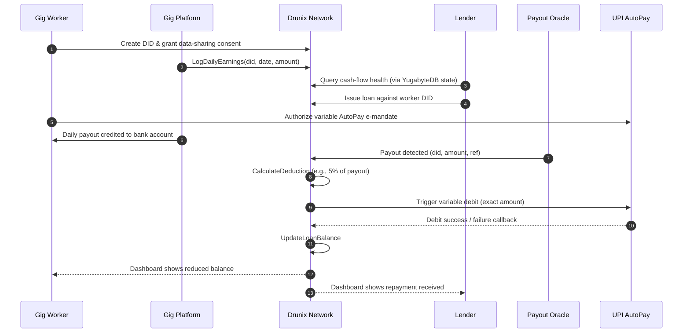
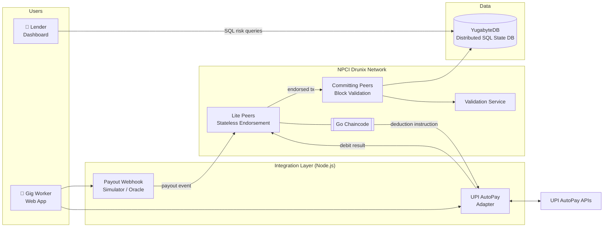
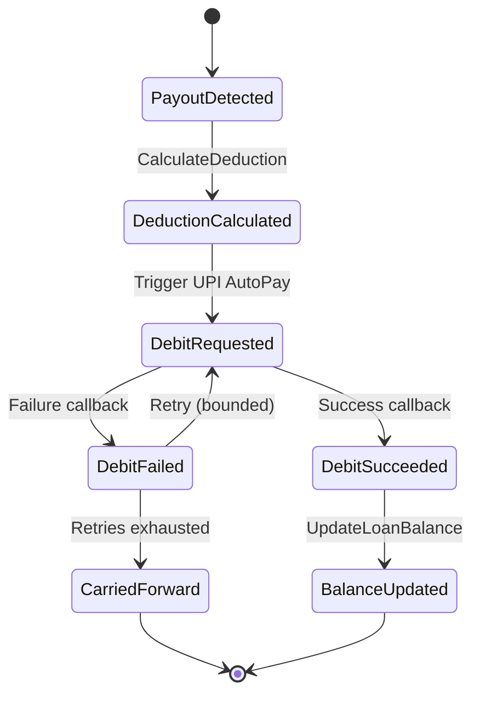
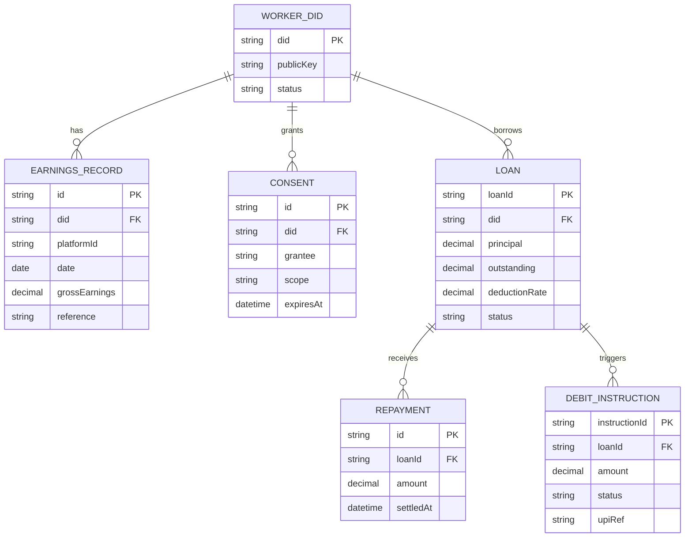

<div align="center">

# 💧 MicroStream

### Real-Time Micro-Credit Streaming for Gig Workers
**Powered by NPCI Drunix and UPI AutoPay**

*Replacing the rigid monthly EMI with repayment that flows in step with every rupee earned.*


-blue)


[Problem](#-problem-statement) •
[Solution](#-solution-overview) •
[Architecture](#-system-architecture) •
[Getting Started](#-getting-started) •
[Demo](#-demo-walkthrough) •
[Roadmap](#-roadmap)

</div>

---

## 📑 Table of Contents

1. [Overview](#-overview)
2. [Problem Statement](#-problem-statement)
3. [Solution Overview](#-solution-overview)
4. [How It Works](#-how-it-works)
5. [System Architecture](#-system-architecture)
6. [Technology Stack](#-technology-stack)
7. [Smart Contract (Chaincode) Design](#-smart-contract-chaincode-design)
8. [Data Model](#-data-model)
9. [Privacy & Security](#-privacy--security)
10. [Expected Impact](#-expected-impact)
11. [Getting Started](#-getting-started)
12. [Project Structure](#-project-structure)
13. [Implementation Plan](#-implementation-plan)
14. [Demo Walkthrough](#-demo-walkthrough)
15. [Pitch Deck Outline](#-pitch-deck-outline)
16. [Assumptions, Risks & Limitations](#-assumptions-risks--limitations)
17. [Roadmap](#-roadmap)
18. [Contributing](#-contributing)
19. [License](#-license)

---

## 🔭 Overview

**MicroStream** is a blockchain-based lending platform that lets gig workers and daily wage earners access formal credit **without a CIBIL score**, and repay it **in real time as a small fraction of each day's earnings**, rather than through a fixed monthly EMI.

| | |
|---|---|
| **Problem** | Gig workers are invisible to traditional credit scoring and are punished by rigid EMIs when income fluctuates. |
| **Approach** | Immutable on-chain earnings history for underwriting + automated, proportional daily deductions via UPI AutoPay. |
| **Core Tech** | NPCI Drunix, Go/Java chaincode, YugabyteDB, UPI AutoPay APIs |
| **Outcome** | Inclusive credit access, near-zero collection cost, and dramatically fewer defaults. |

---

## ❗ Problem Statement

India's gig economy is booming, but the people powering it (delivery partners, ride-hailing drivers, daily wage earners) remain largely **invisible to traditional credit systems**.

### 1. No credit footprint
Platform workers typically lack a formal CIBIL score. Without a score, they are frequently rejected for loans or pushed toward **predatory lenders**.

### 2. Volatile income meets rigid repayment
Conventional loans rely on fixed monthly **Equated Monthly Installments (EMIs)**. A gig worker may earn well for three weeks and fall short in the fourth. Despite healthy cash flow overall, the worker **defaults on a single rigid due date**.

### 3. Expensive, manual underwriting
Lenders cannot cheaply verify irregular income. Bank statements, manual checks, and field verification make small-ticket lending to this segment uneconomical.

```
Weekly earnings:   ₹6,000    ₹5,500    ₹6,200    ₹1,800   ← slow week
                     ✔         ✔         ✔         ✖
Monthly EMI due:                                   ₹5,000  🔴 DEFAULT
```

> The worker's **total** monthly income was ample, but the **timing** of a fixed EMI caused failure.

---

## 💡 Solution Overview

MicroStream replaces the monthly EMI with **dynamic, real-time repayment streaming**. It has three pillars:

### 🪪 1. Identity & Underwriting
- The worker creates a **Decentralized Identity (DID)** on the Drunix blockchain.
- With the worker's **consent**, their gig platform (e.g., Zomato, Uber) logs daily earnings immutably to a Drunix smart contract.
- Lenders query this on-chain state to assess **cash-flow health** and issue a loan, **without the worker exposing personally identifiable information (PII)**.

### 🔁 2. Dynamic Repayment
- After the loan is issued, the worker authorizes a **variable UPI AutoPay e-mandate**.

### 🌊 3. The Streaming Loop
- When the gig platform deposits the daily payout into the worker's bank account, a **Drunix oracle** detects it.
- The **chaincode** calculates a micro-fraction (e.g., **5%**) of *that specific day's* earnings.
- It immediately triggers the **UPI AutoPay API** to deduct that exact amount.
- Repayment is instant, painless, and **proportional to exactly what the worker earned that day**.

> **Good day → larger repayment. Slow day → smaller repayment. No cliff at month-end.**

---

## ⚙️ How It Works

### End-to-End Flow



### Worked Example

Assume a **₹10,000** loan and a **5%** daily deduction rate.

| Day | Daily Payout | Deduction (5%) | Outstanding Balance |
|-----|-------------:|---------------:|--------------------:|
| Start | — | — | ₹10,000 |
| Day 1 | ₹1,000 | ₹50 | ₹9,950 |
| Day 2 | ₹1,400 | ₹70 | ₹9,880 |
| Day 3 | ₹300 *(slow day)* | ₹15 | ₹9,865 |
| Day 4 | ₹0 *(off day)* | ₹0 | ₹9,865 |
| Day 5 | ₹1,200 | ₹60 | ₹9,805 |

The repayment pace adapts automatically to the worker's real income. No missed-EMI event can occur.

---

## 🏗 System Architecture

### High-Level Architecture



### Component Responsibilities

| Component | Role |
|---|---|
| **Drunix Lite Peers** | Stateless endorsement of transactions for high throughput on daily micro-transactions. |
| **Drunix Committing Peers** | Validate and commit blocks to the ledger. |
| **Validation Service** | Standalone service that validates transactions before commit. |
| **Chaincode (Go)** | Business logic: log earnings, compute deduction, update loan state. |
| **YugabyteDB** | Distributed SQL state database enabling complex risk queries directly on ledger state, **without moving data off-chain**. |
| **Payout Oracle / Webhook** | Detects the gig platform's daily payout and feeds it to the chain. |
| **UPI AutoPay Adapter** | Creates variable mandates, executes debits, and handles retry logic. |
| **Worker App** | Streaming loan balance, earnings, and mandate status. |
| **Lender Dashboard** | Real-time SQL views of pooled cash flows and portfolio health. |

### Streaming Loop State Machine



---

## 🧰 Technology Stack

| Layer | Technology | Purpose |
|---|---|---|
| **Blockchain Infrastructure** | **NPCI Drunix** (enhanced Hyperledger Fabric fork) | Permissioned ledger for identity, earnings, and loan state |
| **Smart Contracts** | **Go** (Java supported) chaincode | Deduction calculation and loan balance logic |
| **State Database** | **YugabyteDB** (Distributed SQL) | Risk-assessment queries directly on ledger state |
| **Endorsement & Validation** | **Drunix Lite Peers** + **Committing Peers** | High-throughput, stateless endorsement and block validation |
| **Payments** | **UPI AutoPay APIs** | Variable mandate creation, execution, and retry logic |
| **Middleware** | **Node.js** | Payout webhook simulation and UPI AutoPay API orchestration |
| **Frontend** | Mobile-responsive web app | Worker and lender dashboards |

---

## 📜 Smart Contract (Chaincode) Design

The chaincode is written in **Go** and exposes three core functions, supported by a small set of helpers.

### Core Functions

#### `LogDailyEarnings`
Records a worker's daily earnings, submitted by an authorized gig platform.

| | |
|---|---|
| **Caller** | Authorized gig platform identity |
| **Inputs** | `did`, `platformId`, `date`, `grossEarnings`, `reference` |
| **Behavior** | Verifies platform authorization and worker consent; rejects duplicates for the same `did` + `date` + `reference`; writes an immutable earnings record. |
| **Output** | Earnings record ID |

#### `CalculateDeduction`
Determines how much to deduct from a detected payout.

| | |
|---|---|
| **Caller** | Payout oracle / system identity |
| **Inputs** | `loanId`, `payoutAmount`, `payoutRef` |
| **Behavior** | Applies the loan's deduction rate (e.g., 5%) to the payout; enforces guardrails (never exceed outstanding balance; optional per-day cap); returns the exact amount to debit. |
| **Output** | `deductionAmount` and a unique debit instruction ID (idempotency key) |

```
deduction = min( payoutAmount × deductionRate , outstandingBalance , dailyCap )
```

#### `UpdateLoanBalance`
Applies the result of a debit attempt to the loan.

| | |
|---|---|
| **Caller** | UPI adapter (via callback) |
| **Inputs** | `loanId`, `debitInstructionId`, `status`, `amountDebited`, `upiRef` |
| **Behavior** | On success, reduces outstanding balance and records a repayment; on failure, records the failure and any carried-forward amount; closes the loan at zero balance. |
| **Output** | Updated loan record |

### Supporting Functions (Suggested)

| Function | Purpose |
|---|---|
| `RegisterWorkerDID` | Register a worker's decentralized identity |
| `GrantConsent` / `RevokeConsent` | Manage data-sharing consent for platforms and lenders |
| `IssueLoan` | Create a loan linked to a DID with terms (principal, rate, cap) |
| `GetLoan` / `GetEarningsSummary` | Read helpers for dashboards |

### Design Principles
- **Idempotency:** every debit instruction carries a unique ID so retries never double-charge.
- **Determinism:** chaincode contains no external calls; the oracle and UPI adapter handle off-chain interaction.
- **Least privilege:** only authorized identities can write earnings or update balances.

---

## 🗄 Data Model

### On-Chain State (Logical)



### Example Risk Query (YugabyteDB)

Lenders can assess cash-flow health directly on ledger state, without exporting data:

```sql
-- Average daily earnings and volatility over the last 60 days, per worker DID
SELECT
  did,
  COUNT(*)                          AS active_days,
  ROUND(AVG(gross_earnings), 2)     AS avg_daily_earnings,
  ROUND(STDDEV(gross_earnings), 2)  AS earnings_volatility
FROM earnings_records
WHERE date >= CURRENT_DATE - INTERVAL '60 days'
GROUP BY did
HAVING COUNT(*) >= 30
ORDER BY avg_daily_earnings DESC;
```

---

## 🔐 Privacy & Security

| Concern | Approach |
|---|---|
| **PII exposure** | Lenders see DID-linked cash-flow data, not names, bank statements, or identity documents. |
| **Consent** | Earnings are shared only after explicit, revocable, scoped consent recorded on-chain. |
| **Permissioned network** | Drunix is a permissioned ledger; participants are identified and authorized. |
| **Immutability** | Earnings and repayments cannot be altered retroactively, which builds trust between lenders and workers. |
| **Payment safety** | Worker authorizes a bounded variable mandate; every debit carries an idempotency key. |
| **Off-chain data minimization** | Risk analytics run on ledger state via SQL, avoiding bulk data movement. |

---

## 📈 Expected Impact

### 🤝 Zero-Friction Financial Inclusion
Unlocks formal credit for millions of gig workers by replacing credit scores with **immutable cash-flow data**.

### 🛡 Elimination of Defaults
By deducting a small percentage of earnings **at the moment of payout**, lenders virtually eliminate manual collection costs and month-end EMI defaults.

### 🔒 Privacy-Preserving Underwriting
Workers prove earning capacity **without handing over bank statements** or exposing sensitive PII to public networks.

### Stakeholder Benefits

| Stakeholder | Benefit |
|---|---|
| **Gig workers** | Access to affordable formal credit; repayment that adapts to income; dignity and no predatory lenders. |
| **Lenders / Banks** | Lower underwriting and collection costs; real-time visibility into portfolio cash flows. |
| **Gig platforms** | Improved worker retention and financial wellness at minimal integration effort. |

---

## 🚀 Getting Started

> ⚠️ **Note:** This is a hackathon prototype. Commands below are indicative and should be adapted to your Drunix distribution, network access, and environment.

### Prerequisites

- Access to the **NPCI Drunix** distribution and documentation
- **Docker** and **Docker Compose**
- **Go** 1.20+ (chaincode)
- **Node.js** 18+ and npm (middleware and frontend)
- **YugabyteDB** (local or containerized)

### 1. Clone the Repository

```bash
git clone https://github.com/<your-org>/microstream.git
cd microstream
```

### 2. Start the Drunix Test Network

Bring up a local network with Lite Peers, Committing Peers, and the standalone Validation Service.

```bash
cd network
./scripts/network-up.sh      # starts Lite Peers, Committing Peers, Validation Service
./scripts/channel-create.sh  # creates the application channel
```

### 3. Deploy the Chaincode

```bash
cd ../chaincode/microstream
go mod tidy
cd ../../network
./scripts/deploy-chaincode.sh microstream ../chaincode/microstream
```

### 4. Start the Integration Middleware

```bash
cd ../middleware
cp .env.example .env         # configure Drunix + UPI sandbox/mocks
npm install
npm run start
```

### 5. Launch the Frontend

```bash
cd ../frontend
npm install
npm run dev
```


### Configuration

| Variable | Description | Example |
|---|---|---|
| `DRUNIX_GATEWAY_URL` | Drunix gateway endpoint | `http://localhost:7051` |
| `DRUNIX_CHANNEL` | Channel name | `microstream-channel` |
| `DRUNIX_CHAINCODE` | Chaincode name | `microstream` |
| `YUGABYTE_URL` | SQL connection string | `postgresql://yugabyte@localhost:5433/microstream` |
| `UPI_MODE` | `mock` or `sandbox` | `mock` |
| `DEDUCTION_RATE` | Default streaming rate | `0.05` |
| `MAX_DEBIT_RETRIES` | Retry attempts on failed debits | `3` |

---

## 🗂 Project Structure

```
microstream/
├── network/                  # Drunix test network scripts & config
│   ├── config/
│   └── scripts/
├── chaincode/
│   └── microstream/          # Go chaincode
│       ├── earnings.go       # LogDailyEarnings
│       ├── deduction.go      # CalculateDeduction
│       ├── loan.go           # UpdateLoanBalance, IssueLoan
│       └── identity.go       # DID & consent
├── middleware/               # Node.js integration layer
│   ├── routes/
│   │   ├── payout-webhook.js # Simulates gig platform payout
│   │   └── upi-autopay.js    # Mandate + variable debit
│   └── services/
├── frontend/                 # Mobile-responsive web app
│   ├── worker-dashboard/
│   └── lender-dashboard/
├── db/
│   └── queries/              # YugabyteDB risk-assessment SQL
├── docs/                     # Architecture diagrams, pitch assets
└── README.md
```

---

## 🛠 Implementation Plan

The prototype is built in four phases during the hackathon.

| Phase | Focus | Deliverables |
|---|---|---|
| **1. Drunix Network Setup** | Local test network | Lite Peers, Committing Peers, standalone Validation Service running |
| **2. Chaincode Development** | Core business logic | Go chaincode with `LogDailyEarnings`, `CalculateDeduction`, `UpdateLoanBalance` |
| **3. API Mocking** | Off-chain integration | Node.js middleware simulating the gig platform payout webhook and triggering the UPI AutoPay variable-debit API |
| **4. Frontend MVP** | User-facing views | Worker dashboard (streaming loan balance) and lender dashboard (real-time SQL queries of pooled cash flows) |

### Frontend MVP Views

**👷 Worker Dashboard**
- Live streaming loan balance
- Daily earnings and deduction history
- AutoPay mandate status

**🏦 Lender Dashboard**
- Real-time SQL queries of pooled cash flows
- Portfolio repayment progress
- Cash-flow health indicators per worker DID

---

## 🎬 Demo Walkthrough

1. **Onboard:** The worker creates a DID and grants consent to the gig platform and lender.
2. **Earnings logged:** The platform logs daily earnings to the Drunix smart contract.
3. **Underwrite:** The lender runs a SQL risk query on the ledger state and issues a loan.
4. **Mandate:** The worker authorizes a variable UPI AutoPay e-mandate.
5. **Payout:** The simulated webhook delivers a **₹1,000** daily payout.
6. **Stream:** The chaincode computes **₹50** (5%) and triggers the UPI AutoPay debit.
7. **Settle:** The loan balance updates instantly on the ledger and on both dashboards.

---


## ⚠️ Assumptions, Risks & Limitations

This section documents open questions honestly so the project can be evaluated and extended responsibly.

| Area | Consideration |
|---|---|
| **Prototype scope** | Gig platform payouts and UPI AutoPay calls are **mocked** in the hackathon build. |
| **Oracle trust** | The payout oracle is a trust boundary. Production would need redundancy, signed attestations, and dispute handling. |
| **UPI AutoPay constraints** | Variable debits are subject to NPCI/bank rules on mandate limits, frequency, and pre-debit notifications. Design must be validated against current UPI AutoPay specifications. |
| **Regulatory compliance** | Digital lending in India is regulated (e.g., RBI digital lending guidelines, KYC, data protection law). A licensed lender/NBFC partner is required in production. |
| **Consent & data protection** | Consent flows, revocation, and data retention must comply with applicable privacy law. |
| **Failed debits** | Insufficient balance or mandate issues require bounded retries and a carry-forward policy (see state machine). |
| **Platform adoption** | Value depends on gig platforms agreeing to log earnings on-chain. |
| **Income manipulation** | Platforms/workers could attempt to inflate earnings; mitigations include platform attestation and bank-credit reconciliation via the oracle. |
| **Drunix availability** | Feature availability depends on the Drunix distribution and access provided to participants. |

---

## 🗺 Roadmap

- [x] Problem definition and solution design
- [ ] Drunix test network with Lite Peers, Committing Peers, and Validation Service
- [ ] Go chaincode: `LogDailyEarnings`, `CalculateDeduction`, `UpdateLoanBalance`
- [ ] Node.js payout webhook and UPI AutoPay mocks
- [ ] Worker and lender dashboard MVP
- [ ] YugabyteDB risk-assessment query library
- [ ] Integration with UPI AutoPay sandbox
- [ ] **T+0 settlement** for faster lender liquidity
- [ ] **Fractional lending pools** using Drunix native tokenization, allowing retail investors to fund micro-loan pools
- [ ] Adaptive deduction rates based on real-time cash-flow health
- [ ] Multi-platform earnings aggregation per worker DID
- [ ] Production hardening: audits, compliance review, oracle redundancy

---

## 🤝 Contributing

Contributions are welcome.

1. Fork the repository
2. Create a feature branch: `git checkout -b feature/your-feature`
3. Commit your changes: `git commit -m "Add your feature"`
4. Push to the branch: `git push origin feature/your-feature`
5. Open a Pull Request

Please keep chaincode changes covered by unit tests and document any new configuration variables.

---

## 📄 License

Distributed under the **MIT License**. See `LICENSE` for details.

---

<div align="center">

**MicroStream** — *credit that flows the way income does.*

</div>
